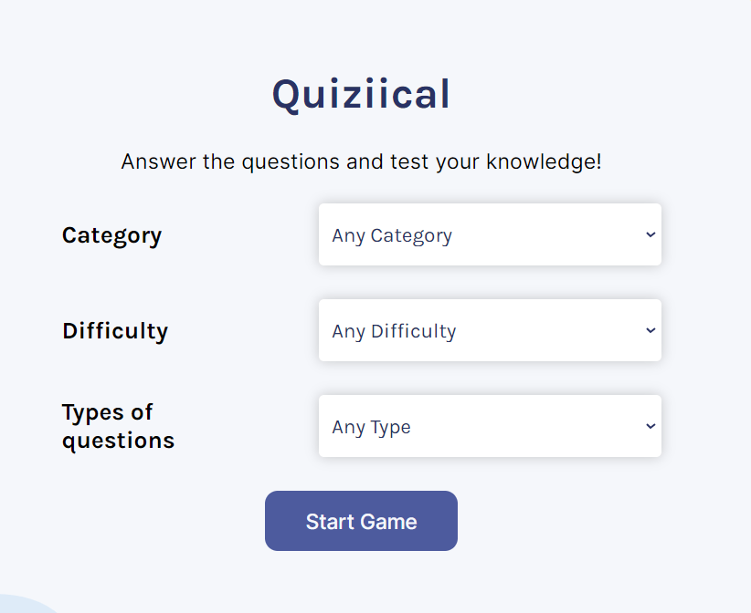
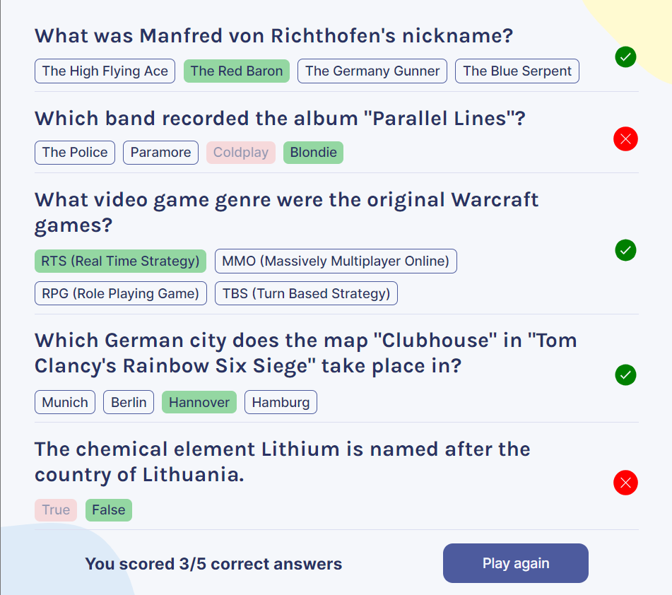

# Quizzical

Welcome to **Quizzical**, an exciting trivia game where users test their knowledge by answering various trivia questions.

## What is Quizzical

**Quizzical** is a trivia game built using React. This is the final solo project completely made from scratch as part of Scrimba's Learn React for Free Course.

## Technical Details

**Quizzical** utilizes several key React hooks and makes use of external APIs for trivia questions. Technologies used include:


## Installation

To run Quizzical locally, follow these steps:

```bash
git clone https://github.com/Shitanshukumar607/quizzical.git
cd quizzical
npm install
npm start
```

The app should now be running on [http://localhost:3000](http://localhost:3000).

## Screenshots





## Features

- **Multiple Categories:** Trivia questions from various categories like Science, History, Sports, etc.
- **Scoring System:** Earn points for each correct answer.
- **Responsive Design:** Play seamlessly on both desktop and mobile devices.

- **Question Selection (Coming Soon):** Choose the number of questions you want to answer. **(added on 18-07-24)**
- **Settings Navigation (Coming Soon):** Ability to go back to the home page and change settings.
- **Dark Mode (Coming Soon):** Switch to a dark mode style for a better visual experience.
- **Sounds (Coming Soon):** Enjoy sound effects for correct answers and more.

## Contributing

We welcome contributions! Fork the repository, create a branch for your feature, make your changes, and submit a pull request.
